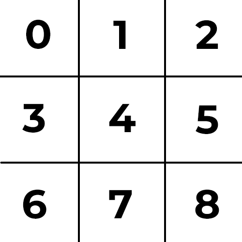

# tictactoe

This is a Tictactoe game for The Odin Project made using JS. You can find the console version on the Scripts under the name [tictactoe.js](https://github.com/kagunecode/tictactoe/blob/main/scripts/tictactoe.js). In order to run it you will need to create a `Game()` object. You can then use `playRound()` passing the position argument for the player. The turns are switched automatically, so there's no need to pass any other argument. For the position you want to play it should be a position from 0 to 8 following this position chart:

Since the main approach of this project is to build the game using a web UI the programming of the console edition was not the priority, so there could be bugs.

